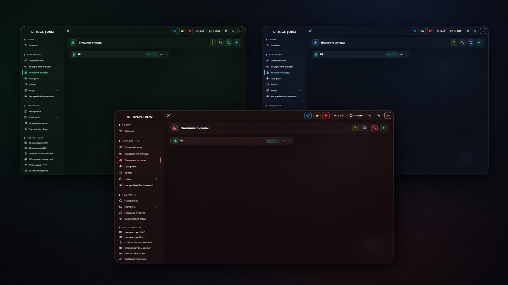
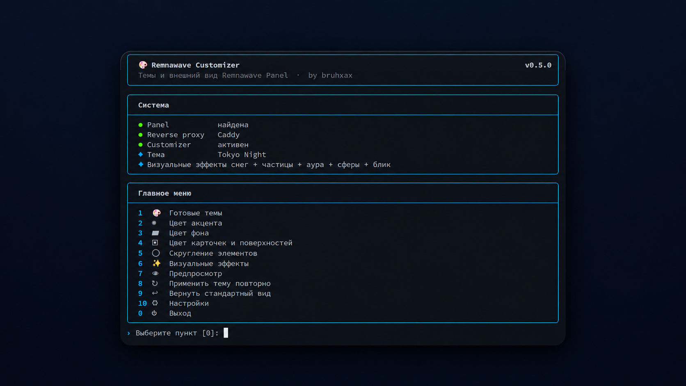

<div align="center">

# 🎨 Remnawave Customizer

**Темы, цвета, скругления и визуальные эффекты для Remnawave Panel прямо из консоли.**

**64 готовые темы · Panel + локальный Subscription Page · безопасный сброс к оригиналу**

[English](README_EN.md) · [MIT License](LICENSE)

</div>

<p align="center">
  
</p>

> [!IMPORTANT]
> **Устанавливайте программу исключительно на сервер, где установлена Remnawave Panel.**

Customizer меняет внешний вид Panel через отдельный CSS-слой: официальный frontend, база данных и файлы Remnawave не заменяются. Обычные обновления Panel можно выполнять как раньше.

Если **Subscription Page находится на том же сервере, что и Panel**, в меню доступно отдельное оформление Sub Page: свои цвета и скругления, готовые темы, сброс к оригиналу и синхронизация с темой Panel.

## Интерфейс

<p align="center">
  
</p>

## Установка

```bash
git clone https://github.com/bruhxax/remnawave-customizer.git
cd remnawave-customizer
sudo ./install.sh
```

## Запуск

```bash
customizer
```

## Обновление

```bash
cd ~/remnawave-customizer
git pull
sudo ./install.sh --no-setup
```

Настройки сохраняются.

## Полное удаление

```bash
cd ~/remnawave-customizer
sudo ./uninstall.sh --purge
cd ~ && rm -rf ~/remnawave-customizer
```

Полное удаление возвращает оригинальный вид Remnawave и локального Sub Page, а также удаляет Customizer, его настройки, runtime, backups и локальный клон репозитория.

---

<div align="center">
<sub>by <a href="https://github.com/bruhxax">bruhxax</a></sub>
</div>
