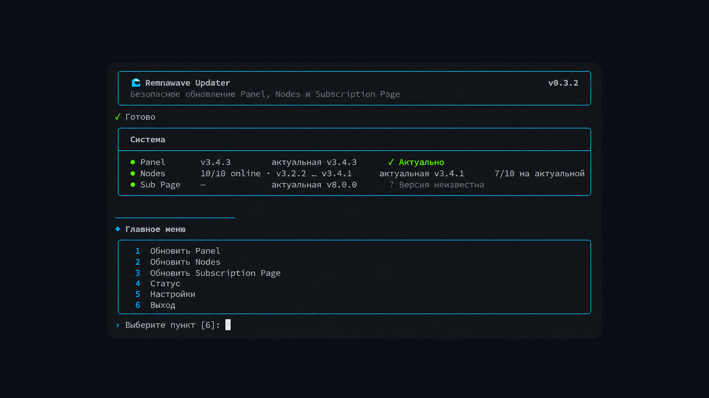

<div align="center">

# 🎨 Remnawave Customizer

**Themes, colors, rounding and visual effects for Remnawave Panel from the console.**

[Русский](README.md) · [MIT License](LICENSE)

<br>


<sub>Examples of ready-made themes</sub>

</div>

> [!IMPORTANT]
> **Install this program only on the server where Remnawave Panel is installed.**

Customizer changes Panel appearance through a separate CSS layer. The official frontend, database and Remnawave files are not replaced, so normal Panel upgrades can be performed as usual.

## Interface

<div align="center">

<br>
<sub>Manage themes, colors and effects from the console</sub>
</div>

## Install

```bash
git clone https://github.com/bruhxax/remnawave-customizer.git
cd remnawave-customizer
sudo ./install.sh
```

## Run

```bash
customizer
```

## Update

```bash
cd ~/remnawave-customizer
git pull
sudo ./install.sh --no-setup
```

Settings are preserved.

## Full uninstall

```bash
cd ~/remnawave-customizer
sudo ./uninstall.sh --purge
cd ~ && rm -rf ~/remnawave-customizer
```

This restores the original Remnawave appearance and removes Customizer, settings, runtime, backups and the local repository checkout.

---

<div align="center">
<sub>by <a href="https://github.com/bruhxax">bruhxax</a></sub>
</div>
